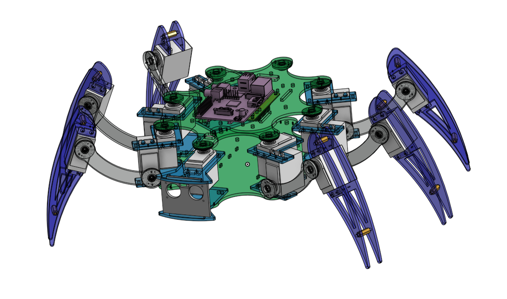
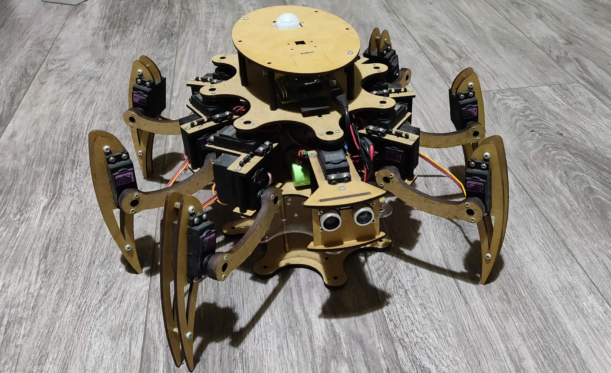

# Hexapod Robert

A very old design of a budget-friendly hexapod that I built years ago.

## Required components
Don't have the detailed parts list, but among the key components were for sure:

* Raspberry Pi 1
* 24 channel Veyron Servo Driver
* at least 18x MG996R servos
* Some generic ultrasonic distance sensor like HC-SR04
* bunch of brass and nylon M3 spacers (15 - 60mm)
* bunch of M3 nuts and bolts
* XBox controller 
* battery may be tricky because of the huge stall current of all the servos together. Find something with C-rate that would allow stalling at least 12 of the servos (hip joints shouldn't stall). I remember using some cheap 6Ah 6V NiMH pack. 

## Manufacturing chassis
Laser-cut all of the parts from 3 - 5mm balsa wood sheet. Acrylic plate is great (but more expensive) and brittle, so the assembly will be more difficult and less forgiving. With balsa you can just mash everything together with wood screws and it'll be fine. 

## Minimal build render

## Actual build

